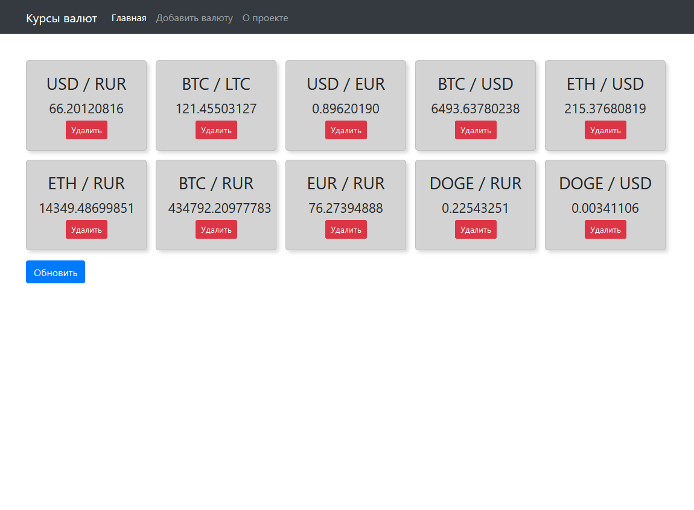

# Курсы валют на React + Redux

Приложение использует API сервиса https://www.cryptonator.com/api/ 

## Установка

Cтавим yarn, если не установлен
```bash
npm install --global yarn
```

Инсталяция приложения
```bash
cd currencies-example

yarn
```

## Запуск dev-сервера

```bash
yarn start
```

## Сборка

```bash
yarn build
```

## Скриншот
